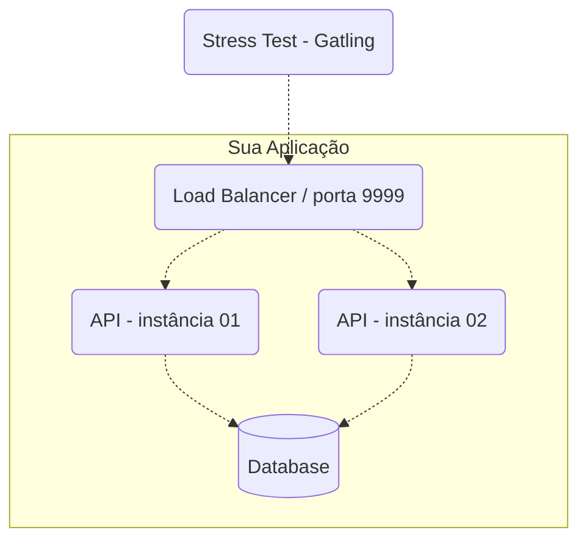
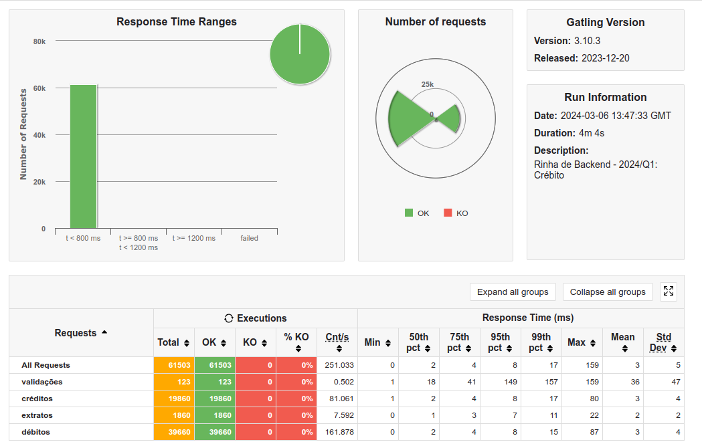
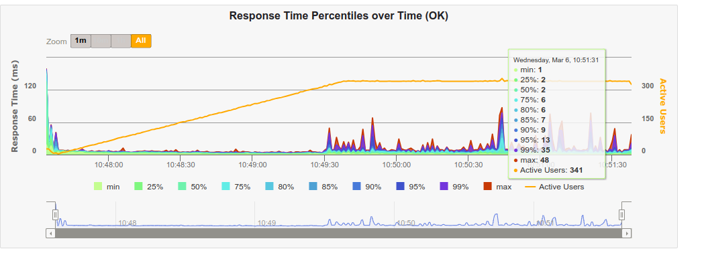

# Rinha de Backend 2024 - Q1

A rinha é um desafio de programação para compartilhar conhecimento. Nessa edição o tema foi controle de concorrência, criando uma API de Créditos e Débitos.

Mais informações do desafio [nesse link](https://github.com/zanfranceschi/rinha-de-backend-2024-q1).

## Stack e Arquitetura

Decidi por utilizar [Go](https://go.dev/) para aprender mais da linguagem. Optei por usar a _standard library_ para criar a API no lugar de frameworks conhecidos e tentei ao máximo construir tudo na mão.

### Decisões

A separação entre camadas: use-cases/services, repositories, controllers ficou para depois. O meu objetivo principal era completar o desafio e ter todas as funcionalidades cobertas com testes. Por isso, desde o começo criei a suite de testes de integração, rodando o banco de dados com Docker.

Com essa garantia dos testes, ficará bem mais fácil refatorar depois para seguir um padrão de Clean Architecture/Hexagonal Architecture ou qualquer outra que for decidida.

### Tecnologias

- [Go](https://go.dev/) para API
- [PostgreSQL](https://www.postgresql.org/) como banco de dados
- [NGINX](https://www.nginx.com/) como load balancer

A arquitetura proposta pelo desafio foi a seguinte.



## Resultados




## Como executar

Para executar somente a API em Go:

```
make run
```

Rodando os testes:

```
make test
```

### Com a infra completa

Caso tenha feito modificações na imagem. Faça o build dela:

```
make build-image
```

Suba todos os containers:

```
make up
```

Para destruir os containers:

```
make down
```

## Licença

[MIT](LICENSE) © André Brandão
